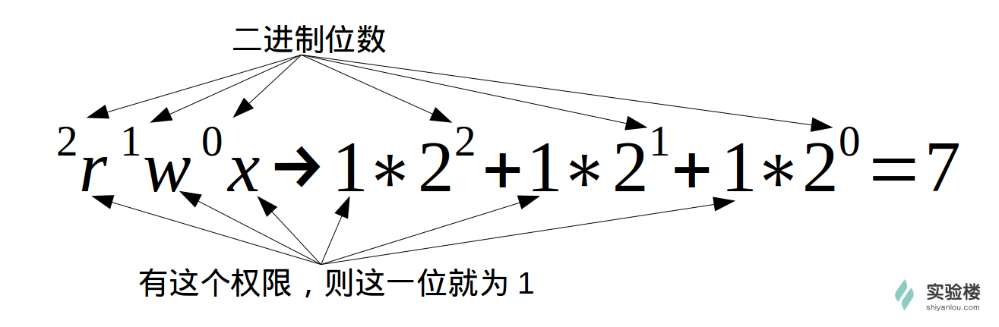

##Linux Basics##
###User&File Permission Control###
* 查看用户

``` 
* who am i
* whoami
* who mom likes 
``` 
* 创建用户

```
* sudo adduser xxx
* su -l xxx  #切换用户
```
* 查看用户组

```
* groups xxx
* cat /etc/group [|[sort][grep -E 'xxx']]
```
* 删除用户

```
* sudo deluser xxx [--remove-home]
```
* 查看目录下文件

```
* ls -l 
```
* 变更文件所有者

```
* sudo chown xxxuser xxxfile
```
* 变更文件权限

```
* sudo chmod xxxnum xxxfile
```
**Notice**: 'xxxnum' can be numbers within '777' as explained below:


another way to do is 

```
* sudo chmod go-rw xxxfile
```
`g`,`o`,`u` means group, others and user; `+`,`-` means add or remove related permission.